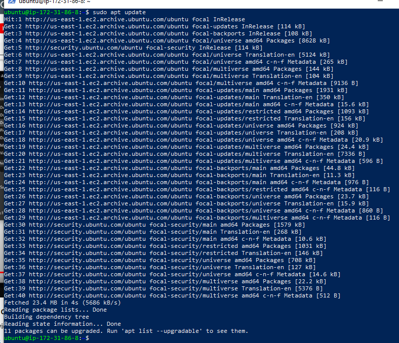
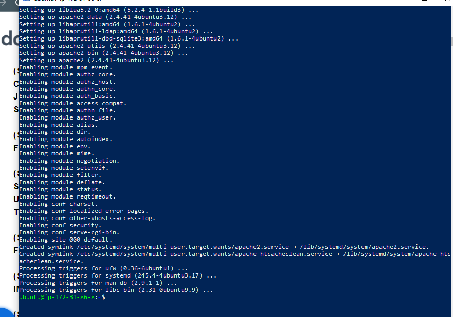
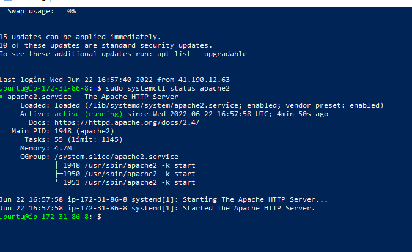
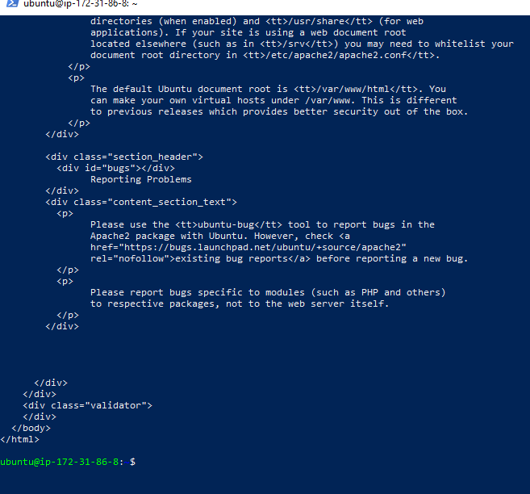
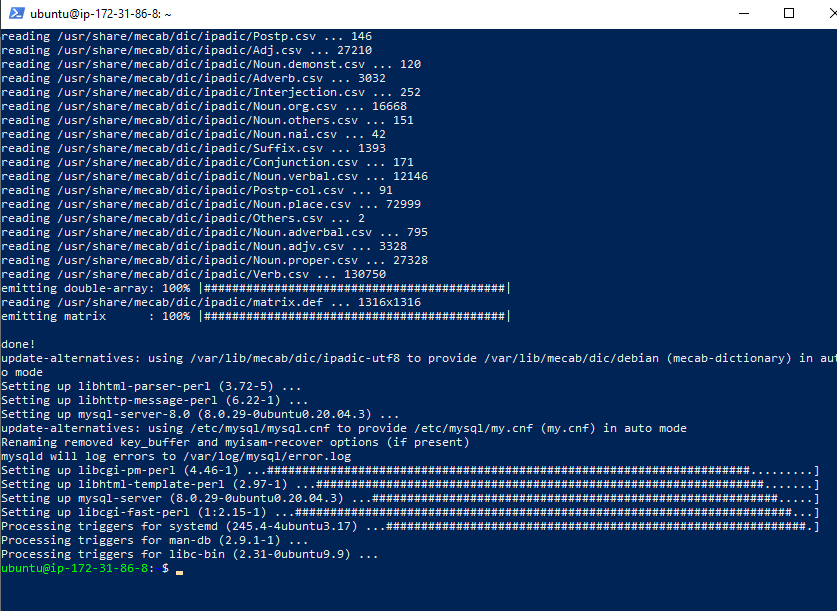
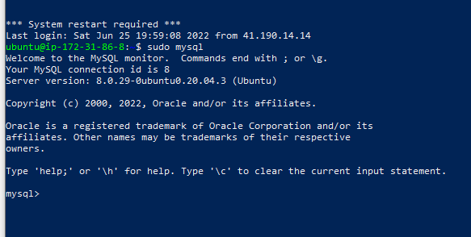
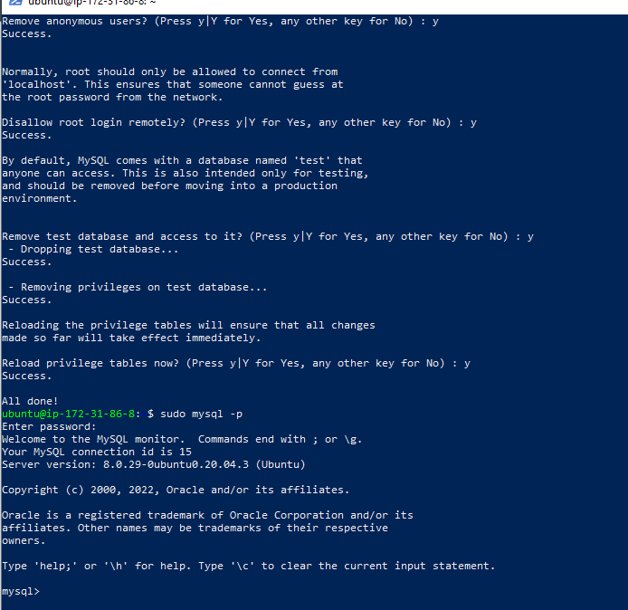
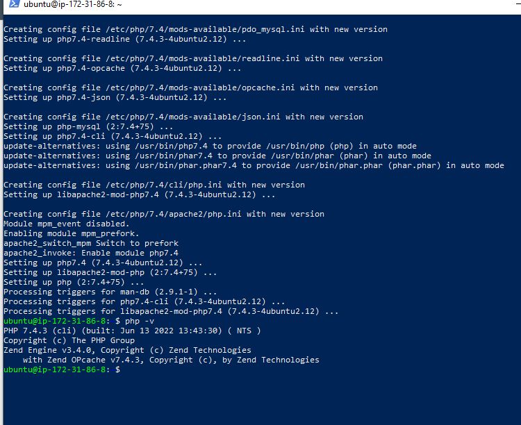
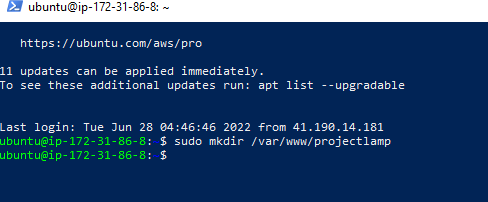
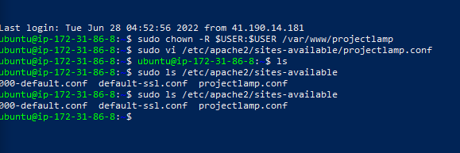

## Project1 Documentation
`sudo apt update`

`sudo apt install apache2`

`sudo systemctl status apache2`

`curl http://localhost:80`

`sudo apt install mysql-server`

`log into MySQL console`

`mysql secure installation`

`installing PHP`

`Create directory for projectlamp`

`Create blank config file in apache`

